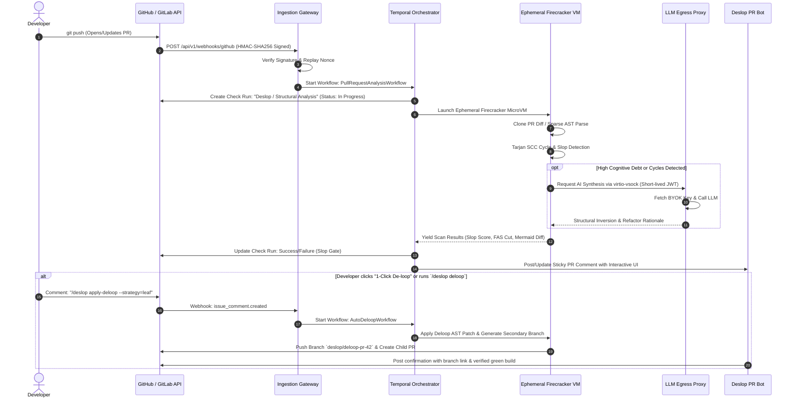
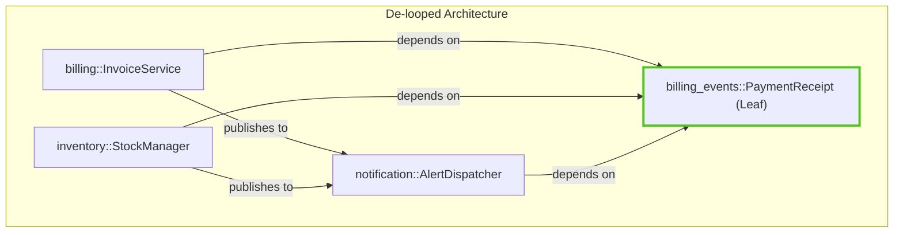
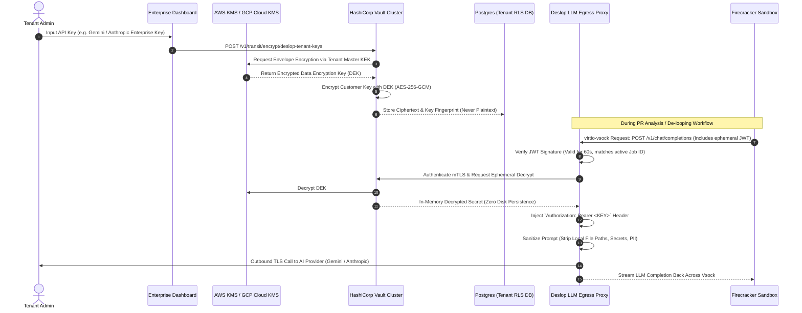
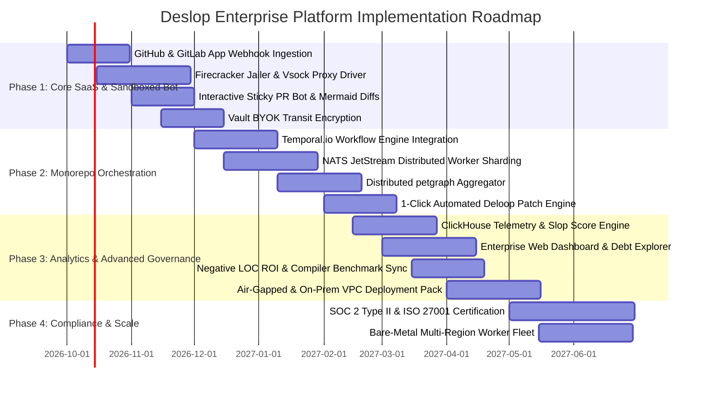

# 🏛️ Deslop Enterprise Cloud & Platform Architecture Blueprint

**Version:** 1.0.0-PROD  
**Author:** Enterprise Cloud & Platform Architect for Deslop  
**Classification:** Technical Architecture Specification  
**Status:** Approved for Implementation  

---

## Executive Summary

Deslop's core Rust engine (`deslop-core`, `deslop-parser`, `deslop-graph`, `deslop-detector`, `deslop-inversion`) provides deterministic, zero-token AST parsing, Tarjan SCC cycle detection, anti-pattern detection (tollbooths, ghost abstractions, clone clusters), and principal-grade de-looping.

This blueprint establishes the **Deslop Enterprise Platform**—a hyperscale, multi-tenant developer platform and CI/CD orchestration system capable of running untrusted customer code in hardened, ephemeral sandboxes, executing distributed monorepo scans across Tokio worker clusters, vaulting customer LLM keys with zero-trust envelope encryption, and delivering high-impact PR bot experiences featuring interactive Mermaid diffs and 1-click refactoring.

---

## 1. Cloud Architecture Topology

The following diagram illustrates the complete enterprise cloud topology spanning edge ingestion, distributed orchestration, hardened sandbox isolation, secure BYOK proxying, and analytical telemetry.

```mermaid
flowchart TD
    subgraph ClientLayer ["1. Developer & Client Layer"]
        GH["GitHub / GitLab Enterprise<br/>(PR Webhooks & Bot Actions)"]
        CLI["Deslop Enterprise CLI<br/>(Developer Workstations)"]
        WEB["Enterprise Web Dashboard<br/>(Architects & Eng Leadership)"]
    end

    subgraph EdgeLayer ["2. Ingress & Edge Gateway (Cloudflare / Envoy)"]
        WAF["Cloudflare WAF / DDoS Guard"]
        APIGW["Envoy API Gateway<br/>(Ed25519 & HMAC Webhook Verifier)"]
    end

    subgraph ControlPlane ["3. Multi-Tenant Control Plane (EKS / GKE)"]
        AUTH["Auth0 / Okta SSO & RBAC"]
        EVENT_GW["Webhook Ingestion Service<br/>(De-duplication & Signature Check)"]
        TEMPORAL["Temporal.io Cluster<br/>(Durable Workflow Orchestrator)"]
        JOB_MGR["Job & Monorepo Shard Manager"]
        NATS["NATS JetStream 2.10<br/>(High-Throughput Work Queue)"]
    end

    subgraph SecurityPlane ["4. Security & BYOK Key Vault"]
        VAULT["HashiCorp Vault / AWS KMS<br/>(Envelope Encryption Engine)"]
        LLM_PROXY["Egress LLM Proxy<br/>(mTLS Auth + Ephemeral Key Injection)"]
        PROVIDER_AI["AI Providers<br/>(Gemini, OpenAI, Anthropic, OpenRouter)"]
    end

    subgraph ExecutionPlane ["5. Hardened Sandbox Worker Pool (Bare Metal / KVM)"]
        POOL_MGR["Ephemeral Pool Allocator<br/>(Pre-warmed Snapshot Cache)"]
        
        subgraph MicroVM_1 ["Firecracker MicroVM / gVisor (Tenant A)"]
            JAIL_1["Jailer (cgroupv2, seccomp-bpf, pids=512)"]
            NET_1["Tap Device (Strict Egress Drop)"]
            DESLOP_1["Rust deslop Core Worker<br/>(AST / SDG / Tarjan / Deloop)"]
        end

        subgraph MicroVM_2 ["Firecracker MicroVM / gVisor (Tenant B)"]
            JAIL_2["Jailer (cgroupv2, seccomp-bpf, pids=512)"]
            NET_2["Tap Device (Strict Egress Drop)"]
            DESLOP_2["Rust deslop Core Worker<br/>(AST / SDG / Tarjan / Deloop)"]
        end
    end

    subgraph DataPlane ["6. Storage & Analytics Data Plane"]
        PG["PostgreSQL Aurora (Multi-AZ)<br/>(Tenant RLS, Job State, Audit Logs)"]
        CH["ClickHouse Cluster<br/>(LOC Deltas, Slop Trends, Build Metrics)"]
        S3["Encrypted S3 / GCS Storage<br/>(AST Artifacts & Unified Patches)"]
        REDIS["Redis Sentinel / DragonflyDB<br/>(Distributed Caching & Nonces)"]
    end

    %% Flow connections
    GH -->|Webhooks: PR opened / sync / command| WAF
    CLI -->|mTLS gRPC Scan / Deloop API| WAF
    WEB -->|GraphQL / REST Analytics API| WAF
    WAF --> APIGW
    APIGW --> AUTH
    APIGW --> EVENT_GW
    EVENT_GW -->|Enqueue Scan Event| TEMPORAL
    TEMPORAL -->|Dispatch Tasks| NATS
    NATS --> POOL_MGR
    POOL_MGR -->|Provision Ephemeral Sandboxes| MicroVM_1
    POOL_MGR -->|Provision Ephemeral Sandboxes| MicroVM_2

    %% Sandbox LLM connection
    DESLOP_1 -->|virtio-vsock (Signed JWT Token)| LLM_PROXY
    DESLOP_2 -->|virtio-vsock (Signed JWT Token)| LLM_PROXY
    LLM_PROXY -->|Fetch Decrypted API Key| VAULT
    LLM_PROXY -->|Forward Sanitized Prompt| PROVIDER_AI

    %% Data Storage
    TEMPORAL --> PG
    EVENT_GW --> REDIS
    DESLOP_1 -->|Stream Metrics & Patches| S3
    DESLOP_2 -->|Stream Metrics & Patches| S3
    POOL_MGR -->|Emit Slop & LOC Telemetry| CH
    WEB -->|Query Aggregated Debt| CH
    WEB -->|Manage Policies & Teams| PG
```

---

## 2. CI/CD & Developer Experience: GitHub/GitLab App PR Bot

### 2.1 Webhook Ingestion & Execution Flow

The PR Bot provides non-intrusive, lightning-fast feedback (<15 seconds for average PRs) and principal-engineer level architectural reviews.



### 2.2 Interactive PR Comment Template

When a PR introduces structural debt or circular dependencies, the bot updates a sticky comment with the following rich, interactive layout:

````markdown
## ⚡ Deslop Architectural Analysis & Slop Report

| Metric | Target Branch | This PR | Delta | Status |
| :--- | :---: | :---: | :---: | :---: |
| **Slop Score** | `18 / 100` | `44 / 100` | **+26 (Degraded)** | ❌ Blocked |
| **Circular Cycles (SCC)** | `0` | `2 Detected` | **+2 Cycles** | ❌ Blocked |
| **Ghost Abstractions** | `3` | `7` | **+4** | ⚠️ Warning |
| **Tollbooth Wrappers** | `12` | `21` | **+9** | ⚠️ Warning |
| **Lines of Code (LOC)** | `14,200` | `14,880` | **+680 LOC** | ℹ️ Notice |

---

### 🚨 Critical Architectural Violation: Circular Dependency Loop Detected
A strongly connected component (SCC) was introduced between `billing`, `inventory`, and `notification`:

```mermaid
graph LR
    subgraph Current PR [Circular Entanglement Introduced]
        B["billing::InvoiceService"] -->|imports| I["inventory::StockManager"]
        I -->|imports| N["notification::AlertDispatcher"]
        N -->|imports (Violates DAG)| B
        style N stroke:#ff4d4f,stroke-width:3px,stroke-dasharray: 5 5
    end
```

### 💡 Deslop Recommended De-Looping Strategy: *The Leaf Pattern (Seam Extraction)*
Extract shared event data structures into an independent zero-dependency leaf module `billing_events`:



---

### 🛠️ One-Click Automated Remediations
Click an action below or reply in this PR thread:

- [ [⚡ **Apply De-Loop Refactor (-420 LOC)**](https://app.deslop.io/actions/deloop?pr=42&token=eyJh...#) ]
- [ [🧹 **Prune Tollbooth Wrappers (-180 LOC)**](https://app.deslop.io/actions/prune?pr=42&token=eyJh...#) ]
- [ [📖 **View Full Architectural Inversion Spec**](https://app.deslop.io/org/acme/repo/core/jobs/8841#) ]

*Slash commands:* `/deslop deloop --strategy=leaf` | `/deslop prune` | `/deslop override --reason="Approved by Lead Architect"`
````

---

## 3. Sandbox Execution Engine (Untrusted Customer Repositories)

Customer code execution poses extreme security risks: malicious `build.rs` macros, poisoned `npm` post-install hooks, symlink traversal, memory exhaustion, and cloud metadata SSRF. Deslop implements a **Zero-Trust Ephemeral Virtualization Architecture**.

### 3.1 Isolation Technology Comparison & Selection

| Dimension | Standard Docker Containers | Google gVisor (`runsc`) | AWS Firecracker MicroVMs |
| :--- | :--- | :--- | :--- |
| **Isolation Boundary** | Shared Linux Kernel Namespaces | Virtualized User-Space Kernel | Hardware KVM Hypervisor Boundary |
| **Exploit Resistance** | Low (Kernel CVE escapes host) | High (Syscall emulation filter) | Extreme (Minimalist virtual machine) |
| **Startup Latency** | ~200ms - 800ms | ~150ms | **< 15ms (Cold), < 5ms (Snapshot)** |
| **Memory Overhead** | ~10MB per container | ~30MB per container | **~5MB base overhead per MicroVM** |
| **Network Isolation** | Bridge/Host routing | Filtered netstack | **Isolated TAP device / virtio-vsock** |
| **Production Target** | Dev/Local testing only | Multi-tenant Kubernetes clusters | **High-security Bare-Metal worker nodes** |

**Enterprise Standard:** Deslop deploys dual-tier sandboxing:
1. **Tier 1 (High Throughput / Standard Scans):** Ephemeral **AWS Firecracker MicroVMs** running on bare-metal `c6i.metal` / `c7g.metal` worker fleets managed by a custom Rust Jailer supervisor.
2. **Tier 2 (Kubernetes Native Deployments):** **gVisor (`runsc`)** runtime classes with hardened seccomp profiles for VPCs where bare-metal virtualization is restricted.

### 3.2 Firecracker MicroVM Jailer & Cgroups v2 Specification

Every repository scan executes inside an isolated Jailer sandbox with the following hardware and kernel constraints:

```ini
# /etc/deslop/jailer/sandbox-template.ini
[jailer]
id = "deslop-job-${JOB_ID}"
exec_file = "/usr/bin/firecracker"
uid = 10001
gid = 10001
chroot_base_dir = "/srv/deslop/jail"
daemonize = true

[cgroups_v2]
memory.max = 4294967296        # 4.0 GiB Hard Memory Ceiling
memory.swap.max = 0            # Swap Disabled (Prevent Memory Leaks)
cpu.max = "200000 100000"      # Maximum 2.0 vCPUs
pids.max = 512                 # Fork-bomb protection
io.weight = 100                # Low I/O Priority during burst scans

[seccomp]
filter_level = 2               # Strict BPF syscall blacklist (blocks ptrace, bpf, reboot, kexec)

[network]
mode = "tap_isolated"
egress = "drop_all"            # Default DROP on all IPv4/IPv6 traffic
allow_internal_vsock = true    # virtio-vsock port 10022 for deslop daemon IPC
```

### 3.3 Network Egress Lockdown & SSRF Defense

```mermaid
flowchart LR
    subgraph MicroVM ["Firecracker MicroVM (Tenant Code)"]
        FS["/workspace (tmpfs, noexec, nodev)"]
        BIN["deslop-core Binary (Read-Only)"]
        VSOCK["virtio-vsock Client"]
    end

    subgraph HostWorker ["Bare Metal Worker Host"]
        FW["nftables / iptables Sandbox Bridge"]
        METADATA["Cloud Metadata Sink<br/>(169.254.169.254 - DROP)"]
        VSOCK_DAEMON["Vsock Proxy Gateway<br/>(Unix Domain Socket)"]
    end

    subgraph VPC ["Internal Secure VPC"]
        PROXY["Deslop Egress LLM Proxy<br/>(TLS 1.3 Inspection)"]
        INTERNET["AI APIs (Google / Anthropic / OpenAI)"]
    end

    MicroVM -.->|Direct TCP/IP Outbound| FW
    FW -->|REJECT| METADATA
    FW -->|DROP| HostWorker

    VSOCK -->|Internal Kernel Vsock (Port 10022)| VSOCK_DAEMON
    VSOCK_DAEMON -->|mTLS Token Authenticated| PROXY
    PROXY -->|Forward Sanitized Payload| INTERNET
```

- **SSRF Neutralization:** The TAP device assigned to each VM is connected to an isolated Linux network bridge with zero routing to the host physical interface. All traffic to `169.254.169.254`, `fd00:ec2::254`, internal RFC1918 subnets, and host loopback is dropped at the hypervisor boundary.
- **Controlled Egress via virtio-vsock:** The only outbound channel from the microVM is a point-to-point zero-copy hypervisor socket (`virtio-vsock`). All outbound LLM requests are proxied across this socket using short-lived signed JWT tickets.

---

## 4. Distributed Job Orchestration: Massive Monorepo Scaling

Monorepos at enterprise scale (e.g., 20M+ lines of code, 80,000+ files across multi-crate Rust, Go, or TypeScript Turborepos) cannot be parsed or analyzed in a single process without memory saturation. Deslop solves this with a **Distributed Map-Reduce AST Graph Engine** managed by **Temporal.io** and **NATS JetStream**.

### 4.1 Orchestration Architecture

```mermaid
flowchart TD
    subgraph TemporalCluster ["Temporal.io Durable Workflows"]
        WF_MAIN["MonorepoScanWorkflow"]
        WF_COORD["Shard Coordinator & Aggregator"]
    end

    subgraph IngestionPartitioning ["Tree Ingestion & Partitioning"]
        GIT_SCAN["Git Tree Inspector<br/>(Packfile Streaming Parser)"]
        SHARD_CALC["Deterministic Boundary Sharder<br/>(Workspace / Package Boundary Chunking)"]
    end

    subgraph NATS_Bus ["NATS JetStream 2.10 Event Mesh"]
        Q_AST["stream: AST_PARSING_JOBS (Subject: jobs.ast.*)"]
        Q_REDUCE["stream: GRAPH_REDUCE_JOBS (Subject: jobs.reduce.*)"]
        Q_SYNTH["stream: LLM_SYNTHESIS_JOBS (Subject: jobs.synth.*)"]
    end

    subgraph RustWorkerPool ["Distributed Tokio Rust Worker Fleet"]
        W1["Worker Node 1<br/>(Chunks 1..100)"]
        W2["Worker Node 2<br/>(Chunks 101..200)"]
        W3["Worker Node N<br/>(Chunks N..M)"]
    end

    subgraph GraphReducerPool ["Graph Reducer & Tarjan SCC Engine"]
        REDUCER["Distributed SDG Graph Reducer<br/>(petgraph Merge + Cross-Module Tarjan)"]
        DETECTOR["Anti-Pattern & Slop Metric Evaluator<br/>(Tollbooths, Ghost Traits, Clones)"]
    end

    WF_MAIN --> GIT_SCAN
    GIT_SCAN --> SHARD_CALC
    SHARD_CALC -->|Publish 500-file Shard Messages| Q_AST
    Q_AST --> W1 & W2 & W3

    W1 & W2 & W3 -->|Stream Partial SDG Subgraphs (Protobuf)| Q_REDUCE
    Q_REDUCE --> REDUCER
    REDUCER --> DETECTOR
    DETECTOR -->|Condensed Global Graph + Cycles| WF_COORD
    WF_COORD -->|Enqueue De-loop Synthesis| Q_SYNTH
```

### 4.2 Step-by-Step Monorepo Execution Lifecycle

1. **Deterministic Package Sharding (`deslop-parser`):**
   - The coordinator inspects the Git tree without checking out full files.
   - Files are partitioned along workspace package boundaries (e.g., `packages/*`, `crates/*`, `apps/*`).
   - Work units are generated as deterministic hash shards (maximum 500 files or 50,000 LOC per chunk).
2. **Parallel AST Subgraph Extraction (`deslop-core`):**
   - Tokio workers pull shard tasks from `NATS JetStream`.
   - Each worker parses ASTs in parallel, resolving local symbol definitions (`Node`), import bindings, and call references (`Edge`).
   - The worker emits an optimized binary Protobuf stream: `PartialSymbolDependencyGraph`.
3. **Distributed Graph Merge & Tarjan SCC (`deslop-graph`):**
   - The reducer combines partial graphs into a unified `SymbolDependencyGraph` (SDG).
   - Global cycle detection executes in $O(V + E)$ time using Tarjan's Strongly Connected Components algorithm.
   - For components with $|V| > 1$, the engine computes the **Feedback Arc Set (FAS)** to isolate the lowest-weight breakable edge.
4. **Anti-Pattern Matrix & Synthesis (`deslop-detector` & `deslop-inversion`):**
   - Parallel workers scan the unified graph for tollbooth functions (single pass-through delegators) and ghost traits (traits implemented by exactly one concrete struct).
   - Slop scores are computed across the repository hierarchy.

---

## 5. Multi-Tenant BYOK Key Management & Zero-Trust Vaulting

Enterprise customers require strict privacy: their proprietary code must never be stored on third-party servers, and their proprietary AI credentials (Gemini, OpenAI, Anthropic, OpenRouter) must remain under their sovereign control with cryptographic auditability.

### 5.1 Zero-Knowledge Envelope Encryption Architecture



### 5.2 Key Management Guarantees

1. **No Disk Persistence:** Customer API keys exist in plaintext **exclusively** in the volatile RAM of the Egress LLM Proxy during the exact microsecond the outbound TLS connection is established.
2. **Strict Zero-Retention AI Headers:** Every outbound call to OpenAI, Anthropic, or Google Cloud carries enterprise zero-data-retention flags:
   - OpenAI: `"store": false`
   - Anthropic: `"anthropic-beta": "no-training-2024-01-01"`
   - Google Gemini: Vertex AI Enterprise Data Governance (GDPR / HIPAA compliant, no training).
3. **Cryptographic Tenant Isolation:**
   - Every tenant is assigned a unique KMS Key Alias (`arn:aws:kms:region:account:key/tenant-{uuid}`).
   - PostgreSQL leverages **Row-Level Security (RLS)** with active session claims:
     ```sql
     SET LOCAL app.current_tenant_id = 'tenant-42-acme';
     SELECT * FROM repository_scans WHERE org_id = current_setting('app.current_tenant_id');
     ```

---

## 6. Enterprise Dashboard & Metrics: "Negative LOC as a Feature"

The Deslop Enterprise Dashboard is engineered around a core tenet: **Top engineering organizations measure maturity not by how many lines of code are written, but by how many lines of cognitive bloat and circular spaghetti are deleted.**

```
+---------------------------------------------------------------------------------------------------+
|  DESLOP ENTERPRISE ARCHITECTURAL HEALTH DASHBOARD                                   ACME CORP     |
+---------------------------------------------------------------------------------------------------+
|  [TOTAL SLOP SCORE]         [NEGATIVE LOC ACCELERATOR]     [CYCLES ELIMINATED]   [BUILD TIME]    |
|       14.2 / 100                  -184,920 LOC                    142               -38.4%        |
|  (-32.1% this quarter)         ($3.2M Maint. Saved)         (0 Active Cycles)     (-14m 20s / run)|
+---------------------------------------------------------------------------------------------------+
|  ORGANIZATIONAL DEBT METRICS OVER TIME                                                            |
|   Slop Score                                                                                      |
|   100 |                                                                                           |
|    75 |  *--*                                                                                     |
|    50 |      \                                                                                    |
|    25 |       *---*       *--*                                                                    |
|     0 +------------\-----/----\--------------------------------------------- Month                |
|       Jan          Mar   May   Jul                                                                |
+---------------------------------------------------------------------------------------------------+
|  TOP REFACTORING TARGETS (LONGEST FEEDBACK ARC SETS & TOLLBOOTHS)                                 |
|  Repository             Target Symbol                Anti-Pattern         Impact      Action      |
|  ------------------------------------------------------------------------------------------------ |
|  core-monorepo          crate::auth::TokenWrapper    Tollbooth (1:1)      -840 LOC    [Deloop]    |
|  payment-engine         IOrderBillingBridge          Ghost Trait          -1,200 LOC  [Collapse]  |
|  analytics-pipeline     event_bus <-> dispatcher     Circular SCC (N=4)   -2,410 LOC  [Extract]   |
+---------------------------------------------------------------------------------------------------+
```

### 6.1 The Mathematical Slop Score Formula

Deslop defines an objective, deterministic Slop Index $\mathcal{S} \in [0, 100]$:

$$\mathcal{S} = \min\left(100, \; \omega_c \cdot \sum_{k=1}^K |C_k|^{1.5} \;+\; \omega_g \cdot \frac{N_{\text{ghost}}}{N_{\text{traits}}} \;+\; \omega_t \cdot \frac{N_{\text{toll}}}{N_{\text{functions}}} \;+\; \omega_d \cdot \frac{\text{LOC}_{\text{clone}}}{\text{LOC}_{\text{total}}}\right)$$

Where:
- $|C_k|$ is the number of symbols in the $k$-th Strongly Connected Component (Tarjan cycle). Cycles are weighted super-linearly ($1.5$) because coupling complexity grows exponentially.
- $N_{\text{ghost}} / N_{\text{traits}}$ is the ratio of ghost interfaces (traits implemented by only 1 concrete type with no polymorphic usage).
- $N_{\text{toll}} / N_{\text{functions}}$ is the density of tollbooth functions (single-statement wrappers forwarding calls without mutation or validation).
- $\text{LOC}_{\text{clone}} / \text{LOC}_{\text{total}}$ is the percentage of duplicated AST subtrees detected across the repository.
- Weights: $\omega_c = 35.0, \; \omega_g = 25.0, \; \omega_t = 25.0, \; \omega_d = 15.0$.

### 6.2 Negative LOC ROI Calculator

The dashboard quantifies engineering ROI using empirical productivity models:
- **Maintenance Cost per LOC:** Estimated at \$16.50/year in enterprise engineering overhead (bug surface, onboarding drag, dependency updates).
- **Compile Time Saved:** In languages with heavy static analysis (Rust, C++, TypeScript), breaking cycles restores incremental compilation cache efficiency (sccache, Bazel, Turborepo hit rates improve from ~32% to >91%).
- **Negative LOC as a Feature:** Engineering teams celebrate every merged PR with net-negative LOC that preserves test coverage.

---

## 7. Formal API Contracts

### 7.1 OpenAPI 3.1 REST Specification (Control Plane)

```yaml
openapi: 3.1.0
info:
  title: Deslop Enterprise Platform API
  version: 1.0.0
  description: API for managing enterprise codebase scans, BYOK keys, and de-looping automation.
servers:
  - url: https://api.deslop.io/v1
paths:
  /orgs/{org_id}/repos/{repo_id}/scans:
    post:
      summary: Trigger an on-demand structural scan and cycle analysis
      operationId: triggerScan
      parameters:
        - name: org_id
          in: path
          required: true
          schema: { type: string, format: uuid }
        - name: repo_id
          in: path
          required: true
          schema: { type: string }
      requestBody:
        required: true
        content:
          application/json:
            schema:
              type: object
              required: [git_ref]
              properties:
                git_ref: { type: string, example: "refs/pull/42/head" }
                base_ref: { type: string, example: "main" }
                max_slop_threshold: { type: integer, default: 25 }
                enable_byok_synthesis: { type: boolean, default: true }
      responses:
        '202':
          description: Scan job accepted and queued in Temporal workflow
          content:
            application/json:
              schema:
                type: object
                properties:
                  job_id: { type: string, format: uuid }
                  status: { type: string, example: "QUEUED" }
                  workflow_url: { type: string }

  /actions/deloop:
    post:
      summary: Execute automated 1-click de-looping on a Pull Request
      operationId: executeDeloop
      requestBody:
        required: true
        content:
          application/json:
            schema:
              type: object
              required: [pr_number, repo_id, strategy]
              properties:
                pr_number: { type: integer, example: 42 }
                repo_id: { type: string, example: "acme/backend" }
                strategy:
                  type: string
                  enum: [LEAF_PATTERN, DEPENDENCY_INVERSION, COLLAPSE_DEEP_MODULE]
                  example: "LEAF_PATTERN"
                target_branch_name:
                  type: string
                  example: "deslop/deloop-pr-42"
      responses:
        '200':
          description: De-loop branch successfully generated and patch applied
          content:
            application/json:
              schema:
                type: object
                properties:
                  branch_url: { type: string }
                  lines_deleted: { type: integer, example: 420 }
                  cycles_eliminated: { type: integer, example: 2 }
                  patch_preview_diff: { type: string }

  /orgs/{org_id}/vault/keys:
    put:
      summary: Vault customer BYOK API key with envelope encryption
      operationId: storeBYOKKey
      parameters:
        - name: org_id
          in: path
          required: true
          schema: { type: string, format: uuid }
      requestBody:
        required: true
        content:
          application/json:
            schema:
              type: object
              required: [provider, api_key]
              properties:
                provider:
                  type: string
                  enum: [GEMINI, OPENAI, ANTHROPIC, OPENROUTER]
                api_key:
                  type: string
                  format: password
      responses:
        '204':
          description: Key securely encrypted with tenant KEK in HashiCorp Vault
```

### 7.2 gRPC / Protocol Buffers (Worker & Distributed Graph Exchange)

```protobuf
syntax = "proto3";

package deslop.v1;

option go_package = "github.com/deslop/proto/v1;deslopv1";

// Service executed on Bare-Metal Firecracker Worker Nodes
service WorkerExecutionService {
  rpc ExecuteASTScan (ScanRequest) returns (stream PartialGraphChunk);
  rpc ApplyDeloopPatch (DeloopRequest) returns (DeloopResponse);
}

// Inter-Worker Distributed Graph Reduction Service
service GraphAggregationService {
  rpc MergeSubgraphs (stream PartialGraphChunk) returns (UnifiedGraphResponse);
  rpc ComputeTarjanSCC (GraphCycleRequest) returns (CycleListResponse);
}

message ScanRequest {
  string job_id = 1;
  string tenant_id = 2;
  string repo_url = 3;
  string commit_sha = 4;
  repeated string path_filters = 5;
  int32 max_memory_mb = 6;
}

message PartialGraphChunk {
  string chunk_id = 1;
  int32 sequence_number = 2;
  bool is_last_chunk = 3;
  repeated SymbolNode symbols = 4;
  repeated DependencyEdge edges = 5;
}

message SymbolNode {
  string id = 1;
  string name = 2;
  string file_path = 3;
  int32 start_line = 4;
  int32 end_line = 5;
  enum SymbolType {
    STRUCT = 0;
    TRAIT = 1;
    FUNCTION = 2;
    MODULE = 3;
    TYPE_ALIAS = 4;
  }
  SymbolType symbol_type = 6;
  bool is_ghost_abstraction = 7;
  bool is_tollbooth = 8;
}

message DependencyEdge {
  string source_symbol_id = 1;
  string target_symbol_id = 2;
  enum EdgeKind {
    IMPORTS = 0;
    CALLS = 1;
    IMPLEMENTS = 2;
    FIELD_TYPE = 3;
  }
  EdgeKind kind = 3;
  int32 call_frequency = 4;
}

message CycleListResponse {
  int32 total_cycles = 1;
  repeated StronglyConnectedComponent scc_clusters = 2;
  repeated BreakableEdge recommended_fas_cuts = 3;
}

message StronglyConnectedComponent {
  string scc_id = 1;
  repeated string symbol_ids = 2;
  int32 loop_length = 3;
}

message BreakableEdge {
  string source_symbol_id = 1;
  string target_symbol_id = 2;
  string refactor_strategy = 3; // "LEAF_EXTRACTION" | "INTERFACE_INVERSION"
  string rationale = 4;
}

message DeloopRequest {
  string job_id = 1;
  repeated BreakableEdge edges_to_break = 2;
  bool create_git_branch = 3;
}

message DeloopResponse {
  bool success = 1;
  int32 lines_deleted = 2;
  int32 lines_added = 3;
  string git_patch = 4;
  string secondary_branch_name = 5;
}
```

---

## 8. Phased Enterprise Roadmap



### Detailed Phase Breakdown

| Phase | Milestone Name | Timeline | Core Deliverables | Success KPI |
| :--- | :--- | :--- | :--- | :--- |
| **Phase 1** | **Foundational SaaS & Secure PR Bot** | **Months 1–3** | • GitHub/GitLab App with HMAC signature verification<br>• Firecracker microVM jailer runtime with virtio-vsock<br>• Sticky PR Bot with live Mermaid cycle visualizer<br>• BYOK Vault envelope encryption (Gemini, OpenAI, Anthropic) | PR Scan P95 < 15s; 100% network isolation verified by penetration audit. |
| **Phase 2** | **Distributed Monorepo Scale** | **Months 4–6** | • Temporal.io durable scan workflows<br>• NATS JetStream 2.10 high-throughput chunk queue<br>• Distributed Tokio worker pools with Protobuf graph streams<br>• 1-Click "De-loop This PR" automated branch creation | Monorepos with 10M+ LOC scanned in < 120s; zero OOMs. |
| **Phase 3** | **Enterprise Dashboard & ROI Engine** | **Months 7–9** | • ClickHouse debt time-series aggregation<br>• Negative LOC tracker & maintenance \$ calculator<br>• Incremental compile-time benchmark telemetry<br>• Enterprise RBAC, SAML/Okta SSO, Audit Trail | 30+ enterprise pilot deployments; >20% average PR slop reduction. |
| **Phase 4** | **Global Enterprise Hardening** | **Months 10–12** | • SOC 2 Type II, ISO 27001, HIPAA compliance<br>• Air-gapped on-premises VPC helm/Terraform charts<br>• Multi-region global worker mesh with automated failover<br>• Automated Continuous Architectural Inversion pipelines | 99.99% availability SLA; Zero-data-retention guarantee certified. |

---

## 9. Architectural Invariants & Non-Negotiables

1. **Zero-Trust Code Execution:** No untrusted customer code or AST parser ever touches a shared Linux host kernel. All execution is strictly jailed inside ephemeral Firecracker microVMs or gVisor sandbox runtimes with dropped network egress.
2. **Zero Plaintext Secret Storage:** API keys are enveloped with tenant-specific KMS master keys. Keys exist in decrypted RAM exclusively in the egress proxy for the duration of the outbound TLS handshake.
3. **Deterministic Graph Foundations:** Every cycle detection (Tarjan SCC), Feedback Arc Set, and anti-pattern calculation is executed deterministically in compiled Rust with 0% hallucination risk. AI models are reserved solely for high-level semantic synthesis and refactor explanation.
4. **Negative LOC as the Ultimate Quality Gate:** Engineering velocity is protected by enforcing DAG monotonicity and eliminating pass-through tollbooths and ghost interfaces.
