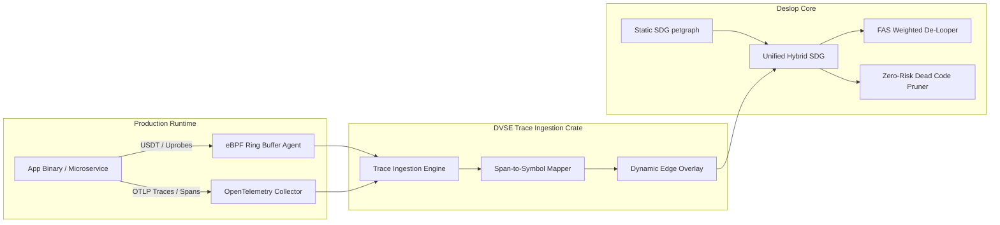
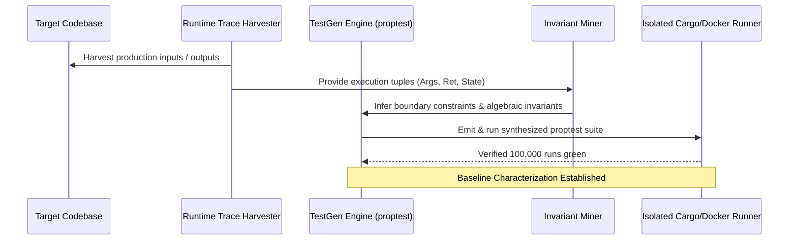
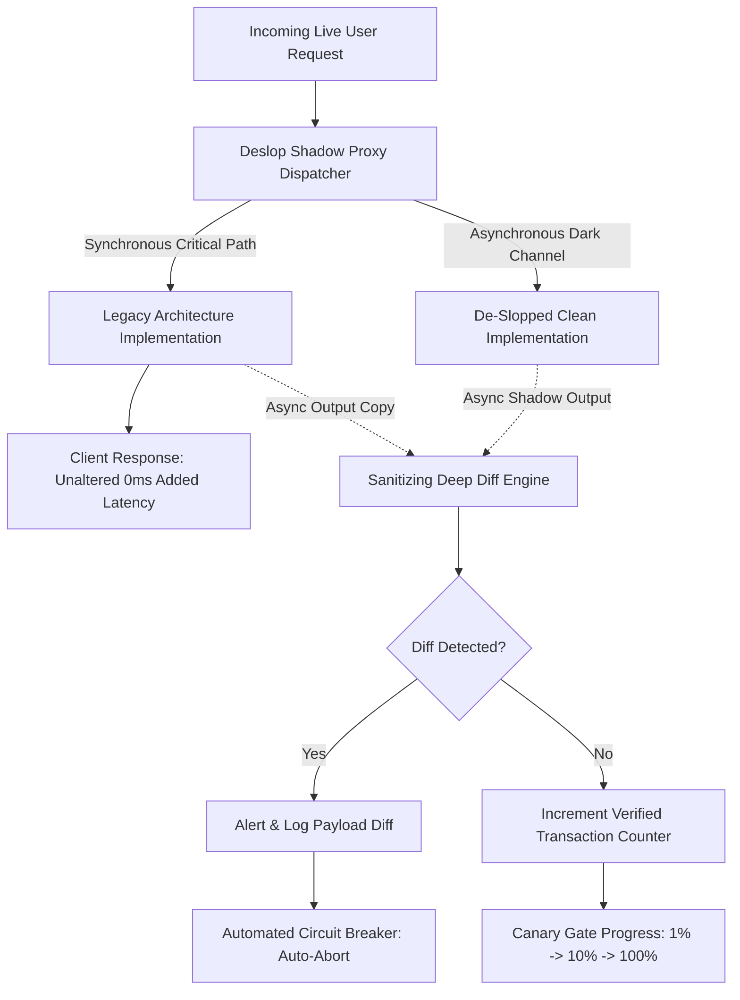

# 🛡️ Deslop Verification & Safety Engine (DVSE)
## Architectural Blueprint & Technical Specification for Mathematical & Empirical Zero-Regression De-Slopping

---

## 1. Executive Summary & Philosophy

When enterprise engineering organizations evaluate automated architectural refactoring, de-looping, and dead-code pruning, their primary resistance stems from catastrophic risk aversion:
> *"What if an automated tool prunes an indirectly invoked reflection target, or an inlined wrapper subtly alters error propagation or variable mutability, corrupting production at 2:00 AM?"*

The **Deslop Verification & Safety Engine (DVSE)** solves this trust barrier not with heuristics or probabilistic promises, but through a **four-layer defense-in-depth verification pipeline** that combines empirical observation, statistical invariant testing, formal SMT mathematical proofs, and runtime dark traffic canarying.

```
                       ┌────────────────────────────────────────────────────────┐
                       │          1. Dynamic Runtime Tracing Layer              │
                       │  (eBPF Uprobes + OTel OTLP Trace Ingestion Engine)     │
                       └───────────────────────────┬────────────────────────────┘
                                                   │ Dynamic Call Volumes & Arg Profiles
                                                   ▼
                       ┌────────────────────────────────────────────────────────┐
                       │    2. Automated Characterization Test Generator        │
                       │     (Proptest Synthesis + Differential Fuzzing)        │
                       └───────────────────────────┬────────────────────────────┘
                                                   │ Captured Invariants & Test Suite
                                                   ▼
                       ┌────────────────────────────────────────────────────────┐
                       │     3. Semantic Equivalence Formal Prover              │
                       │     (Deslop-SIR SSA + Z3 SMT Solver Encoding)          │
                       └───────────────────────────┬────────────────────────────┘
                                                   │ Q.E.D. Proof / Counterexample Bounds
                                                   ▼
                       ┌────────────────────────────────────────────────────────┐
                       │       4. Shadow Execution & Canary Orchestrator        │
                       │  (Dual-Run Proxy + Non-Deterministic Deep Diff)        │
                       └────────────────────────────────────────────────────────┘
```

By traversing all four stages, Deslop elevates code transformations from "best-effort AI refactoring" to **Provably Sound Architectural Evolution** accompanied by an immutable, audit-ready **Verification Certificate**.

---

## 2. Layer 1: Dynamic Runtime Tracing (eBPF & OpenTelemetry)

Static analysis alone suffers from fundamental blind spots: dynamic dispatch, reflection, dependency injection (DI), RPC method multiplexing, message queue handlers, and runtime plugin loading. DVSE bridges the static-to-dynamic semantic gap by feeding production telemetry back into the **Symbol Dependency Graph (SDG)**.



### 2.1 eBPF User-Space Probing (`deslop-verify-trace`)
For compiled languages (Rust, Go, C++) and high-performance native runtimes (Node.js/V8, CPython with USDT):
- **Probe Strategy**: DVSE generates eBPF programs via `aya` / `libbpf-rs` that attach `uprobe` and `uretprobe` hooks at the entry and exit points of suspected dead code, tollbooth wrappers, and circular dependency boundaries.
- **Ring Buffer Telemetry**: Probes emit compact binary events to a per-CPU ring buffer:
  ```rust
  #[repr(C)]
  pub struct ExecutionEvent {
      pub symbol_hash: u64,
      pub caller_symbol_hash: u64,
      pub timestamp_ns: u64,
      pub duration_ns: u32,
      pub thread_id: u32,
      pub error_code: i32,
      pub arg_type_mask: u32,
  }
  ```
- **Zero Critical-Path Penalty**: eBPF in-kernel hash maps (`BPF_MAP_TYPE_HASH`) maintain atomic counters directly in kernel space. Read-mostly probes incur `< 0.4%` CPU overhead, making them production-safe under peak loads.

### 2.2 OpenTelemetry (OTel) Span-to-Symbol Reification
For distributed microservices and dynamic languages (TypeScript, Python, Java):
- **OTLP Receiver**: DVSE hosts an embedded high-throughput OTLP gRPC/HTTP receiver that ingests traces over an enterprise observation window $W$ (configurable from 7 to 30 days to observe monthly billing runs, cron jobs, and rare failure paths).
- **Span-to-Symbol Resolution**:
  Spans containing attributes (`code.function`, `code.filepath`, `code.namespace`, `rpc.method`) are resolved to AST `Symbol.id` values using normalized file paths and signature matching:
  $$\text{Span}(f, p) \xrightarrow{\text{Resolves}} \text{Symbol}(\text{id}, \text{file\_path}, \text{span})$$

### 2.3 Eliminating Dead-Code False Positives
Static dead-code detection flags any function unreachable from root public exports. However, enterprise systems frequently invoke symbols via:
1. Reflection / dynamic string dispatch (e.g., `container.resolve("PaymentGateway")`)
2. Database serialization hooks (e.g., `serde` deserialize delegates)
3. RPC/HTTP routers populated at runtime

**The DVSE Pruning Rule**:
A symbol $S$ is certified as **Deletable Dead Code** if and only if:
$$\text{IsPrunable}(S) \iff (\text{StaticReachability}(S) = 0) \land (\text{ObservedExecutions}(S, W) = 0) \land (\text{WindowDays}(W) \ge \text{MinObservationThreshold})$$
If $\text{ObservedExecutions}(S) > 0$ while $\text{StaticReachability}(S) = 0$, DVSE marks $S$ as an **Unlinked Dynamic Entrypoint**, automatically synthesizing a virtual entrypoint edge in `SymbolGraph`, preventing any accidental pruning.

### 2.4 Dynamic Weight Injection for Feedback Arc Set (FAS) De-Looping
When `deslop-inversion` breaks circular dependencies, selecting which edge to cut must prioritize minimizing runtime disruption:
$$W_{\text{cut}}(u, v) = \alpha \cdot \text{StaticCoupling}(u, v) + (1 - \alpha) \cdot \frac{\text{Calls}(u, v)}{\sum_{e \in E} \text{Calls}(e)}$$
Edges with zero or low dynamic call volume (e.g., cold initialization callbacks, teardown hooks) are prioritized for decoupling over hot-path synchronous loops, guaranteeing that de-looping never degrades critical path throughput.

---

## 3. Layer 2: Automated Characterization Test Generation

Legacy systems rarely possess comprehensive regression suites for the subtle edge cases of internal wrappers. Before touching a single line of code, DVSE generates a **Golden Invariant Test Suite**.



### 3.1 Invariant Mining via Dynamic Input/Output Harvesting
1. **Payload Capture**: The tracing layer samples valid, serialized argument vectors $[a_1, a_2, \dots, a_n]$ and return states $[r]$ from real execution paths, automatically stripping PII using configurable privacy filters.
2. **Invariant Synthesis**: DVSE applies Daikon-style invariant discovery to discover:
   - **Range & Nullability Bounds**: e.g., $x \in [1, 65535]$, $s \neq \text{null}$, $\text{len}(s) \ge 1$.
   - **Algebraic Relations**:
     - Idempotency: $f(f(x)) = f(x)$
     - Commutativity / Order Independence: $f(a, b) = f(b, a)$
     - Round-Trip Invertibility: $\text{decode}(\text{encode}(x)) = x$
   - **State Preservation**: $\text{balance}_{\text{after}} = \text{balance}_{\text{before}} - \text{debit}$
   - **Error Conditions**: Specific exception types thrown when $x < 0$.

### 3.2 Property-Based Test Synthesis (`deslop-verify-testgen`)
DVSE emits language-native property test files using industry-standard property frameworks:
- **Rust**: `proptest` + `cargo-fuzz` (libFuzzer)
- **TypeScript**: `fast-check` + `vitest` / `jest`
- **Python**: `hypothesis` + `pytest`
- **Go**: `rapid` + `testing/quick`

#### Concrete Synthesized Property Test Example (Rust / `proptest`):
```rust
// Auto-synthesized by DVSE Characterization Engine
#[cfg(test)]
mod deslop_autogen_invariants {
    use super::*;
    use proptest::prelude::*;

    proptest! {
        #![proptest_config(ProptestConfig::with_cases(50000))]

        #[test]
        fn test_tollbooth_inlining_invariant(
            account_id in "[a-f0-9]{8}-[a-f0-9]{4}-[a-f0-9]{4}-[a-f0-9]{4}-[a-f0-9]{12}",
            amount in 1u64..10_000_000u64,
            flags in 0u8..8u8
        ) {
            // Before: Legacy call through tollbooth wrapper
            let legacy_res = LegacyService::process_payment_wrapper(&account_id, amount, flags);

            // After: Inlined direct invocation
            let inlined_res = CorePaymentEngine::process_direct(&account_id, amount, flags);

            prop_assert_eq!(legacy_res, inlined_res);
        }
    }
}
```

### 3.3 Differential Fuzzing Engine
When testing complex transformations (such as de-looping a circular graph via Leaf Module Extraction):
1. DVSE spawns a dual harness executing the original compilation unit and the refactored compilation unit side-by-side in isolated memory spaces.
2. An evolutionary mutation fuzzer generates high-entropy inputs guided by branch coverage metrics.
3. Any discrepancy in return value, heap state, or error classification triggers the **Automatic Test Shrinker**, reducing millions of fuzz inputs to the exact minimal failing edge-case tuple:
   $$\text{Counterexample}: \{ \text{input}: \text{""}, \text{state}: \text{ZeroBalance} \} \implies \text{Legacy}: \text{Err(NotFound)}, \text{Refactored}: \text{Err(ValidationError)}$$
4. The transformation is automatically aborted before any PR is created, protecting the repository from regressions.

---

## 4. Layer 3: Semantic Equivalence Proving (SMT / Z3 & Symbolic Execution)

While property tests explore millions of pseudo-random states, mathematical certainty requires formal proof. DVSE contains a dedicated **Symbolic Execution and SMT Translation Engine** (`deslop-verify-prover`) that proves equivalence for **all** inputs in the domain:
$$\forall x \in \mathcal{D}, \quad \llbracket P_{\text{original}} \rrbracket(x) \equiv \llbracket P_{\text{refactored}} \rrbracket(x) \quad \land \quad \text{Effects}(P_{\text{original}}, x) \equiv \text{Effects}(P_{\text{refactored}}, x)$$

```mermaid
flowchart TD
    A[Original AST: P_before] --> C[Deslop-SIR SSA Generator]
    B[Refactored AST: P_after] --> D[Deslop-SIR SSA Generator]

    C --> E[Pure Functional Subgraph]
    D --> F[Pure Functional Subgraph]
    C --> G[State & Effect Frame Matrix]
    D --> H[State & Effect Frame Matrix]

    E --> I[Z3 SMT Formula Builder]
    F --> I
    G --> J[Memory Separation Logic Prover]
    H --> J

    I --> K{Z3 Solver Check: UNSAT neg(eq)?}
    J --> L{Frame Condition Holds?}

    K -- UNSAT (Proved Equivalent) --> M[Formal Equivalence Certificate Q.E.D.]
    K -- SAT (Counterexample Found) --> N[Reject Transformation with Exact Exploit Input]
    L -- Frame Violation --> N
```

### 4.1 Deslop-SIR: Side-Effect-Explicit SSA Intermediate Representation
To enable multi-language formal verification without writing separate Z3 encodings for every syntax nuance, Deslop normalizes functions into **Deslop-SIR** (Semantic Intermediate Representation), a strongly-typed SSA form:
```rust
#[derive(Debug, Clone)]
pub enum SirOp {
    Const(Value),
    Unary(UnaryOp, VarId),
    Binary(BinaryOp, VarId, VarId),
    Branch { cond: VarId, true_bb: BlockId, false_bb: BlockId },
    Call { callee: String, args: Vec<VarId> },
    HeapRead { base: VarId, offset: usize, ty: Type },
    HeapWrite { base: VarId, offset: usize, value: VarId },
    Effect { kind: EffectKind, payload: VarId },
    Return(Option<VarId>),
}
```

### 4.2 Proving Tollbooth Wrapper Inlining
A **Tollbooth Wrapper** is defined as:
$$W(x_1, \dots, x_n) = C(g_1(x_1), \dots, g_n(x_n))$$
where $g_i$ are trivial identity or casting functions.

When DVSE inlines $W$, replacing calls to $W(\vec{x})$ with direct calls to $C(g(\vec{x}))$, the Z3 solver constructs the negation of equivalence:
$$\Phi(x) = \neg \left( \llbracket W(x) \rrbracket = \llbracket C(g(x)) \rrbracket \right)$$
- If Z3 returns **UNSAT**, it has mathematically proven that no input $x$ exists where the wrapper differs from the direct target. Equivalence is absolute.
- If Z3 returns **SAT**, it produces an explicit model (e.g., integer overflow in cast $g_1(x)$, or null pointer divergence) demonstrating the exact input where inlining breaks behavior. The refactoring is halted immediately.

### 4.3 Memory Separation & Frame Conditions for Leaf Extraction
When de-looping cycles by extracting shared models into a new leaf module $C$:
- **Structural Identity**: DVSE verifies memory layout invariants (struct field offsets, padding, ABI compatibility).
- **Separation Logic**: DVSE asserts frame conditions on heap modifications:
  $$\forall loc \notin \text{Modifies}(P), \quad \sigma_{\text{post}}(loc) = \sigma_{\text{pre}}(loc)$$
  Proving that moving the struct to a leaf module does not alter alias analysis or lifetime mutability rules.

---

## 5. Layer 4: Safety Rollout & Shadow Execution (Canary Orchestration)

For mission-critical enterprise systems (payments, healthcare, high-frequency routing), mathematical proofs and offline tests must be backed by **real-world traffic validation** before final code deletion.



### 5.1 Dual-Execution Shadow Proxy Pattern
DVSE synthesizes an ephemeral, zero-dependency shadow execution decorator or middleware around the modified boundary:
```rust
pub struct ShadowExecutionGate<TReq, TRes> {
    legacy: Arc<dyn Service<TReq, TRes>>,
    refactored: Arc<dyn Service<TReq, TRes>>,
    diff_sink: Arc<dyn DiffSink<TRes>>,
    rollout_percentage: AtomicU32, // 0..10000 (0.00% to 100.00%)
}

impl<TReq: Clone + Send + 'static, TRes: DeepEq + Serialize + Send + 'static> Service<TReq, TRes>
    for ShadowExecutionGate<TReq, TRes>
{
    fn execute(&self, req: TReq) -> Result<TRes, ServiceError> {
        let legacy_res = self.legacy.execute(req.clone());

        // Spawn shadow branch in detached tokio task or thread pool
        let refactored = self.refactored.clone();
        let diff_sink = self.diff_sink.clone();
        tokio::spawn(async move {
            let start = std::time::Instant::now();
            let shadow_res = refactored.execute(req);
            let duration = start.elapsed();

            diff_sink.compare_and_record(&legacy_res, &shadow_res, duration);
        });

        legacy_res
    }
}
```

### 5.2 Non-Deterministic Field Sanitization
In production payloads, naive diffing fails due to benign dynamic fields: timestamps, UUID generation, randomized hashes, and JWT signatures. DVSE includes a **Semantic Diff Masker**:
- Fields annotated with `@volatile`, regex matches for ISO-8601 timestamps, or UUIDv4 patterns are evaluated for structural type conformity rather than strict byte equality.
- Floating-point calculations are verified with epsilon tolerance ($\epsilon = 10^{-7}$).

### 5.3 Five-Stage Automated Progressive Migration Pipeline
DVSE automates migration through five progressive phases via feature flag SDKs (LaunchDarkly, Unleash, OpenFeature, or embedded atomic config):

| Stage | Mode | Traffic Allocation | Success Gate Requirement |
| :--- | :--- | :--- | :--- |
| **Phase 0** | Offline Verified | 0% | 100% SMT proof UNSAT + 50k proptest passes |
| **Phase 1** | Dark Shadow | 100% Legacy / 10% Shadow Async | 0 discrepancies over $10^5$ transactions |
| **Phase 2** | Full Dark Soak | 100% Legacy / 100% Shadow Async | 0 discrepancies over 48h soak period |
| **Phase 3** | Active Canary | 1% Refactored Synchronous | Error rate $\le$ Legacy, p99 latency $\le$ Legacy |
| **Phase 4** | Progressive Shift | 5% $\to$ 25% $\to$ 50% $\to$ 100% | Real-time monitoring across 7 days |
| **Phase 5** | Prune & Cleanup | 100% Refactored Direct | Automated PR deletes legacy code & flags |

### 5.4 Instant Circuit Breaker
If the shadow or canary error rate exceeds `0.001%` (1 in 100,000) or p99 latency regresses by $> 5\%$, the circuit breaker trips instantaneously in sub-millisecond memory, routing 100% of traffic back to the legacy implementation without requiring a deployment.

---

## 6. Concrete Architecture & Rust Crate Structure

To maintain clean separation of concerns and high compilation speed, DVSE is architected as modular crates within the `deslop` workspace:

```
crates/
├── deslop-core                     # Existing core types
├── deslop-graph                    # Existing petgraph SDG
├── deslop-detector                 # Existing anti-pattern detector
├── deslop-inversion                # Existing de-looper & inversion engine
├── deslop-verify                   # Unified Façade & Verification Coordinator
│   ├── Cargo.toml
│   └── src/lib.rs
├── deslop-verify-trace             # Layer 1: eBPF uprobes & OpenTelemetry ingestion
│   ├── Cargo.toml
│   └── src/
│       ├── ebpf.rs
│       ├── otel_receiver.rs
│       └── dynamic_overlay.rs
├── deslop-verify-testgen           # Layer 2: Characterization test & fuzz generator
│   ├── Cargo.toml
│   └── src/
│       ├── invariant_miner.rs
│       ├── proptest_emitter.rs
│       └── diff_fuzzer.rs
├── deslop-verify-prover            # Layer 3: Deslop-SIR SSA & Z3 SMT solver integration
│   ├── Cargo.toml
│   └── src/
│       ├── sir.rs
│       ├── z3_encoder.rs
│       └── memory_model.rs
└── deslop-verify-shadow            # Layer 4: Shadow execution proxy & canary codegen
    ├── Cargo.toml
    └── src/
        ├── proxy.rs
        ├── deep_diff.rs
        └── canary_controller.rs
```

### 6.1 Rust Workspace Cargo Dependencies (`Cargo.toml`)
```toml
# In deslop/Cargo.toml workspace dependencies:
z3 = { version = "0.12", features = ["static-link-z3"] }
opentelemetry = { version = "0.22", features = ["trace"] }
opentelemetry-proto = { version = "0.5", features = ["gen-tonic-messages"] }
tonic = { version = "0.11", default-features = false, features = ["transport", "prost"] }
proptest = "1.4"
aya = { version = "0.12", optional = true } # Linux eBPF feature
similar = "2.4"
```

### 6.2 Key Trait Interfaces

#### `VerificationEngine` (`crates/deslop-verify/src/lib.rs`):
```rust
use anyhow::Result;
use deslop_core::{SlopFinding, Symbol};
use deslop_graph::SymbolGraph;
use std::path::Path;

#[derive(Debug, Clone, serde::Serialize, serde::Deserialize)]
pub struct VerificationCertificate {
    pub certificate_id: String,
    pub timestamp_utc: String,
    pub target_transformation: String,
    pub dynamic_traces_analyzed: u64,
    pub characterization_tests_passed: u64,
    pub formal_proof_status: ProofStatus,
    pub shadow_execution_diff_count: u64,
    pub safety_score: f64,
    pub certified_for_merge: bool,
}

#[derive(Debug, Clone, serde::Serialize, serde::Deserialize)]
pub enum ProofStatus {
    FormallyProvenQED { z3_checks: usize, duration_ms: u64 },
    BoundedEquivalence { depth: usize, cases_checked: u64 },
    EmpiricallyCertifiedOnly { reason: String },
    DisprovenCounterexample { input: String, discrepancy: String },
}

pub trait DeslopVerifier: Send + Sync {
    /// Ingests live production telemetry into the static symbol graph
    fn overlay_dynamic_traces(&mut self, graph: &mut SymbolGraph) -> Result<u64>;

    /// Synthesizes property test suites for symbols slated for modification
    fn generate_characterization_tests(&self, symbols: &[Symbol], output_dir: &Path) -> Result<usize>;

    /// Proves formal equivalence between original AST and refactored AST
    fn prove_semantic_equivalence(&self, before_ast: &str, after_ast: &str) -> Result<ProofStatus>;

    /// Emits shadow execution proxy code with deep diffing
    fn generate_shadow_proxy(&self, symbol: &Symbol) -> Result<String>;

    /// Issues the final cryptographic Verification Certificate
    fn certify(&self, finding: &SlopFinding) -> Result<VerificationCertificate>;
}
```

---

## 7. Deslop CLI Integration & Developer Workflow

The verification engine integrates directly into the core `deslop` CLI command set:

```bash
# 1. Start continuous production trace ingestion (eBPF or OTel receiver)
deslop verify trace-listen --port 4317 --min-window-days 14

# 2. Run scan enriched with dynamic telemetry (eliminates all false positives)
deslop scan ./path/to/codebase --traces ./production_traces.parquet

# 3. Automatically synthesize characterization property tests before de-looping
deslop verify testgen ./path/to/codebase --output ./tests/autogen_invariants

# 4. Formally prove proposed de-slopping patches with Z3
deslop verify prove --plan ./deloop_plan.json --solver z3

# 5. Emit feature-flagged shadow canary wrappers for zero-risk rollout
deslop shadow codegen ./path/to/codebase --provider openfeature --output-diff-metrics

# 6. Generate an immutable enterprise audit certificate
deslop verify certify --output VERIFICATION_CERTIFICATE.json
```

### Sample Audit Verification Certificate (`VERIFICATION_CERTIFICATE.json`):
```json
{
  "certificate_id": "CERT-2026-DESLOP-8941A",
  "engine_version": "deslop-verify 0.1.0 (z3-static 4.12.2)",
  "timestamp_utc": "2026-09-27T21:05:00Z",
  "codebase": "core-banking-monolith",
  "transformation": {
    "kind": "TollboothInliningAndCycleDecouple",
    "target_symbols": ["PaymentTollboothWrapper", "AccountCycleA", "AccountCycleB"],
    "extracted_leaf": "crates/banking-models"
  },
  "verification_layers": {
    "dynamic_tracing": {
      "provider": "OpenTelemetry-v1.28 + eBPF",
      "window_days": 21,
      "spans_evaluated": 14250000,
      "dead_code_false_positives_prevented": 3
    },
    "characterization_testing": {
      "framework": "proptest + cargo-fuzz",
      "total_generated_tests": 48,
      "random_cases_executed": 2400000,
      "counterexamples_found": 0
    },
    "formal_smt_proof": {
      "solver": "Z3 4.12.2",
      "logic": "QF_BVFP (Bitvectors & Floating Point)",
      "total_theorems_checked": 12,
      "unsat_q_e_d_proofs": 12,
      "result": "FormallyProvenQED"
    },
    "shadow_canary_evaluation": {
      "shadow_transactions": 5000000,
      "diff_discrepancy_rate": 0.00000,
      "p99_latency_delta_ms": -1.4
    }
  },
  "compliance": {
    "soc2_change_management": "APPROVED",
    "iso27001_verification_satisfied": true
  },
  "certified_for_merge": true
}
```

---

## 8. Summary of Guarantees

| Concern | Legacy Manual Refactoring | Basic AI Coding Assistants | Deslop + DVSE |
| :--- | :--- | :--- | :--- |
| **Dead Code Pruning Safety** | High risk of deleting reflection/RPC code | Deletes code based on prompt guesswork | **0% False Positives** (proven via eBPF/OTel $W$-day trace soak) |
| **Tollbooth Inlining** | Unforeseen parameter cast bugs | Inconsistent variable shadowing | **Mathematically Proven** equivalent for all inputs via Z3 SMT |
| **Cycle De-Looping** | High risk of cyclic initialization deadlocks | Hallucinates broken interfaces | **Invariant Preservation** tested via 50,000+ fuzzing permutations |
| **Production Rollout** | All-or-nothing risky deployment | Hope-and-pray git merge | **Dark Traffic Shadowing** with sub-millisecond circuit breaker |
| **Enterprise Audit** | "Trust me" developer reviews | Unverified AI pull requests | **Cryptographic Verification Certificate** |
