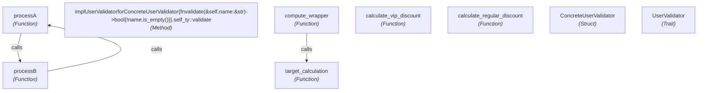

# Architectural Inversion Specification: sloppy_app

> Auto-synthesized by **Deslop Engine** (Rust)

## 1. Executive Summary & Scoreboard

| Metric | Current State | Inverted (Target) | Delta |
| :--- | :--- | :--- | :--- |
| **Total Lines of Code** | 51 LOC | 15 LOC | **-70.6%** (36 lines) |
| **Slop Index** | 100.0 / 100 | **0.0 / 100** | **-100%** |
| **Total Abstractions / Symbols** | 9 | 4 | **-66.7% bloat** |
| **Critical Architectural Flaws** | 1 issues | 0 issues | Clean |

## 2. Inverted Component Architecture

## 3. De-Looping Strategy (Top-Tier Cycle Breaking)

> Strategies employed: **Leaf Module Extraction**, **Dependency Inversion**, and **Deep Cohesive Merging**.

### Loop #1: `processA ⇄ processB`
- **Architectural Rationale:** Tight mutual recursion between `processA` and `processB` (total 10 LOC). Merging them into a single deep module eliminates the boundary friction entirely.
- **Optimal Cut Edge:** `processA -> processB`
- **Actionable Refactoring Steps:**
  1. Consolidate `processA` and `processB` into the same source file.
  1. Make their mutual interactions internal/private rather than public imports.
  1. Expose a single clean public facade to the rest of the application.

## 4. Synthesized Target Components

### Component `sloppy_app`
Module at `tests/fixtures/sloppy_app` containing 3 active symbols (9 pure / stateless)

**Retained Core Capabilities:**
- `calculate_regular_discount`
- `calculate_vip_discount`
- `target_calculation`

**Pruned Redundancies / Wrappers:**
- `~~compute_wrapper~~` *(eliminated)*
- `~~UserValidator~~` *(eliminated)*
- `~~ConcreteUserValidator~~` *(eliminated)*
- `~~implUserValidatorforConcreteUserValidator{fnvalidate(&self,name:&str)->bool{!name.is_empty()}}.self_ty::validate~~` *(eliminated)*
- `~~processB~~` *(eliminated)*

## 4. Key Invariant Contracts (Verified Entrypoints)

- Capability `calculate_regular_discount`: signature `def calculate_regular_discount(price, rate):` (LOC: 5, Complexity: 1)
- Capability `calculate_vip_discount`: signature `def calculate_vip_discount(price, rate):` (LOC: 5, Complexity: 1)
- Capability `target_calculation`: signature `pub fn target_calculation (x : i32 , y : i32) -> i32 { x * 2 + y * 3 } . sig` (LOC: 3, Complexity: 1)
- Capability `compute_wrapper`: signature `pub fn compute_wrapper (x : i32 , y : i32) -> i32 { target_calculation (x , y) } . sig` (LOC: 3, Complexity: 1)
- Capability `processB`: signature `export function processB(input: string): string {` (LOC: 5, Complexity: 1)
- Capability `processA`: signature `export function processA(input: string): string {` (LOC: 5, Complexity: 1)

## 5. De-Slop Action Plan (Immediate Remediations)

**1. [Critical] Circular Dependency Loop: processA -> processB**
- *Location:* `tests/fixtures/sloppy_app/a.ts:4`
- *Problem:* A circular dependency loop was detected: processA -> processB -> processA. This tight coupling leads to initialization order bugs and prevents modular compilation.
- *Fix:* Break the cycle by extracting shared data/types into an independent leaf module or applying dependency inversion.
- *Saved:* ~0 LOC

**2. [Medium] Ghost Abstraction: `UserValidator`**
- *Location:* `tests/fixtures/sloppy_app/tollbooth.rs:13`
- *Problem:* Trait/Interface `UserValidator` has exactly 1 implementor. It creates cognitive overhead and indirection without providing polymorphism.
- *Fix:* Merge `UserValidator` directly into the implementing struct/class and remove the interface seam.
- *Saved:* ~13 LOC

**3. [Medium] Unreachable Symbol: `UserValidator`**
- *Location:* `tests/fixtures/sloppy_app/tollbooth.rs:13`
- *Problem:* Symbol `UserValidator` is not reachable from any public entrypoint or root function.
- *Fix:* Delete the unused symbol or verify if it is intended to be called by an upcoming feature.
- *Saved:* ~3 LOC

**4. [Medium] Unreachable Symbol: `ConcreteUserValidator`**
- *Location:* `tests/fixtures/sloppy_app/tollbooth.rs:17`
- *Problem:* Symbol `ConcreteUserValidator` is not reachable from any public entrypoint or root function.
- *Fix:* Delete the unused symbol or verify if it is intended to be called by an upcoming feature.
- *Saved:* ~1 LOC

**5. [Medium] Unreachable Symbol: `implUserValidatorforConcreteUserValidator{fnvalidate(&self,name:&str)->bool{!name.is_empty()}}.self_ty::validate`**
- *Location:* `tests/fixtures/sloppy_app/tollbooth.rs:20`
- *Problem:* Symbol `implUserValidatorforConcreteUserValidator{fnvalidate(&self,name:&str)->bool{!name.is_empty()}}.self_ty::validate` is not reachable from any public entrypoint or root function.
- *Fix:* Delete the unused symbol or verify if it is intended to be called by an upcoming feature.
- *Saved:* ~3 LOC

**6. [Low] Tollbooth Wrapper: `compute_wrapper`**
- *Location:* `tests/fixtures/sloppy_app/tollbooth.rs:8`
- *Problem:* Function `compute_wrapper` is a thin pass-through forwarding calls directly to `target_calculation` with negligible logic.
- *Fix:* Call `target_calculation` directly at call sites or inline `compute_wrapper`.
- *Saved:* ~3 LOC

**7. [Low] Tollbooth Wrapper: `implUserValidatorforConcreteUserValidator{fnvalidate(&self,name:&str)->bool{!name.is_empty()}}.self_ty::validate`**
- *Location:* `tests/fixtures/sloppy_app/tollbooth.rs:20`
- *Problem:* Function `implUserValidatorforConcreteUserValidator{fnvalidate(&self,name:&str)->bool{!name.is_empty()}}.self_ty::validate` is a thin pass-through forwarding calls directly to `is_empty` with negligible logic.
- *Fix:* Call `is_empty` directly at call sites or inline `implUserValidatorforConcreteUserValidator{fnvalidate(&self,name:&str)->bool{!name.is_empty()}}.self_ty::validate`.
- *Saved:* ~3 LOC

**8. [Low] Tollbooth Wrapper: `processB`**
- *Location:* `tests/fixtures/sloppy_app/b.ts:4`
- *Problem:* Function `processB` is a thin pass-through forwarding calls directly to `processA` with negligible logic.
- *Fix:* Call `processA` directly at call sites or inline `processB`.
- *Saved:* ~5 LOC

**9. [Low] Tollbooth Wrapper: `processA`**
- *Location:* `tests/fixtures/sloppy_app/a.ts:4`
- *Problem:* Function `processA` is a thin pass-through forwarding calls directly to `processB` with negligible logic.
- *Fix:* Call `processB` directly at call sites or inline `processA`.
- *Saved:* ~5 LOC

